# Smart Home Prototype (SSA 2023)
The following program is a prototype for The Smart Home by The A Team (Group 1) to satify the requirements of Assignment 2 of the Secure System Architecture module. The program comprises an initialiser, server, and client hub, and has been encrypted with RSA and Fernet keys. The focus of the project hypothesis question are the veracity of these keys' security as compared to SHA512.

## Setup
### Prerequisites
* Python ^3.10
* hashid (`sudo apt-get install hashid`)

### Installing
1. Install the required dependencies in `requirements.txt`:
   * `pip install -r requirements.txt` (Windows) || `pip3 install -r requirements.txt` (Linux)
   
3. Run `python initialise.py` || `python3 initialise.py`
   * <b>Please note</b>: `initialise.py` should only be run once per computing environment. If it is run more than once, the code will break.
   * To create a separate environment, follow these steps:
     * `python -m venv [name of environment]` || `python3 -m venv [name of environment]`
     * `source [name of env]/bin/activate` || `source [name of env]/bin/activate`

This will initialise the RSA and Fernet keys for encryption.

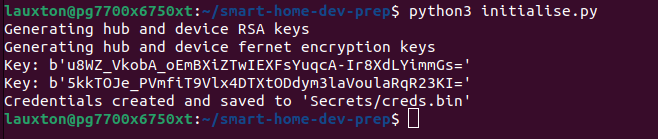

## Run the Program
On a separate terminal each:
1. Run `python deviceservice.py` || `python3 deviceservice.py`
2. Run `python hub.py` || `python3 hub.py`

Device simulation is set by running `deviceservice.py`. 

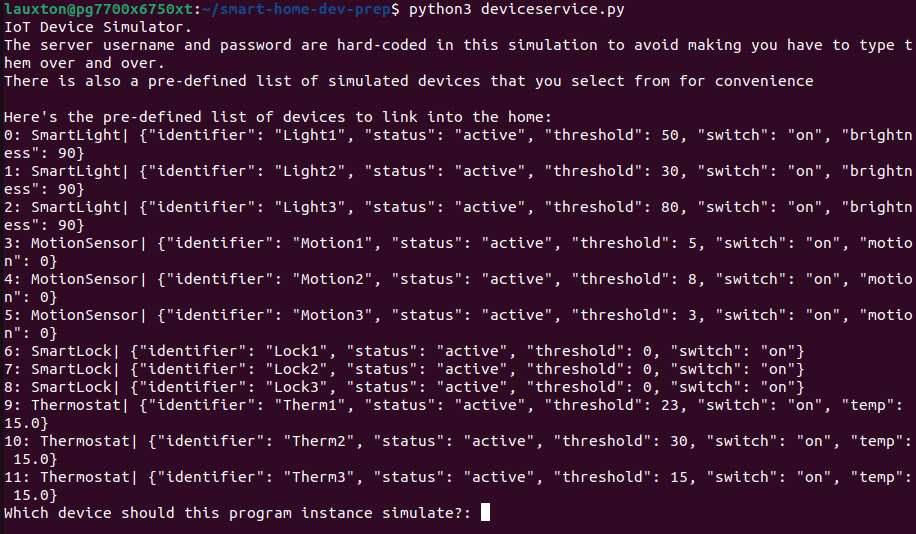

Device settings can be manipulated by interacting with the client interface in `hub.py` 

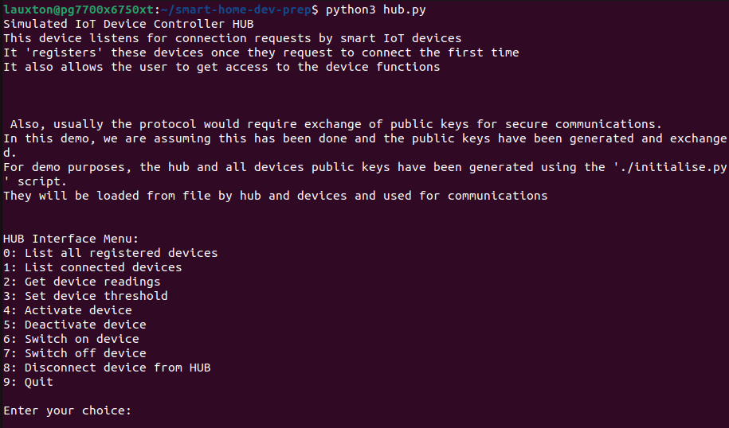

## Assumptions
1. For the purpose of this proof of concept demo, the devices are assumed to use the same set of public and private encryption keys
   
## Discussion

### Program testing
The code was tested for _____ using pylint (PyPi, 2023), which produced the following results:

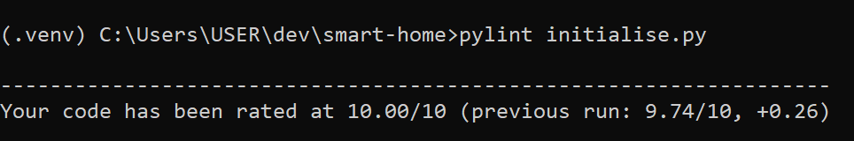
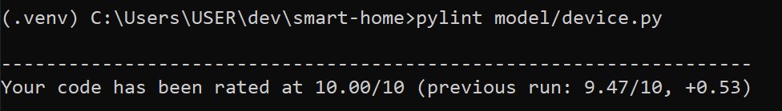

It should be noted that

### Security Testing

Testing the ability of RSA and Fernet encryption to withstand hash identification is at the heart of this project. Our team sought to build a comprehensive clienthub and server that could simulate actual smart device use, and then encrypt that program. Our goal was then to demonstrate that RSA and Fernet encryption hashes were harder to crack than SHA512 hashes. 

RSA was chosen as an encryption key (Hamza & Kumar, 2020) because 
* it is asymmetrical and has both public and private keys
* the Diffie-Hellman algorithm "is a key component of the framework" (Tang & Zhou, 2011: 1118)

Fernet was chosen as an encryption key (Pronika & Tyagi, 2021) because 
* it is symmetrical and a "lightweight method based on AES-128-CBC" (Asaad et al., 2022: 1)
* this algorithm is intended for constrained IoT devices not unlike the simulated devices in our code.

These keys were used together in the project, as it is standard practice to have asymmetrical and symmetrical encryption for comprehensive protection (Tang & Zhoi, 2011).

SHA512 was chosen as a control encryption (null hypothesis) key because
* it is standardized by NIST (Dobraunig et al, 2015)
* it is the "most widely used hash function" (Ambat et al, 2020), and is considered more secure than other hash functions

### Hypothesis Testing

Proving the veracity of an encryption algorithm can be difficult outside the realm of mathematics, so our group decided to take a hacker's mindset to testing. We would see how easy each hash was to identify, as this can make bruteforcing quite simple.

To set a null hypothesis, we took a piece of code from an unused earlier version of our project and implemented SHA512 to encrypt some passwords and ran the program to generate a hash:

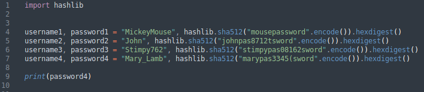

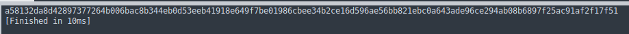

We then ran this hash through the popular command line tool _Hashid_ (Pypi, 2015), which can determine the type of hash presented to be further decrypted by bruteforcing tools like _Hashcat_ (Hashcat, 2022). This resulted in a positive hit in the system, correctly determining the hash to be SHA512:

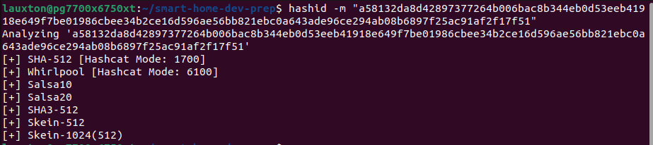

The real-world effort to cracking this hash would be minimal, and those without much hacking skill would be able to figure out how to do so from a hacking tutorial on Youtube (Avocari, 2021). We thus set this as our H0: all hashed keys would behave similarly to SHA512.

We then repeated the process for the RSA and Fernet hashes, which were provided during initialisation. Both the RSA hash and Fernet hashes were found to be unknown in the _hashid_ system: 

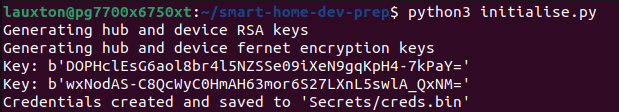

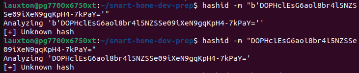

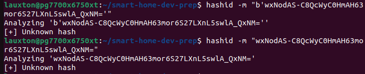

We then used the website `https://www.dcode.fr/cipher-identifier` to see if the cipher type could be recognised (DCode, 2023). 

Results did not return either RSA or Fernet suggestions:

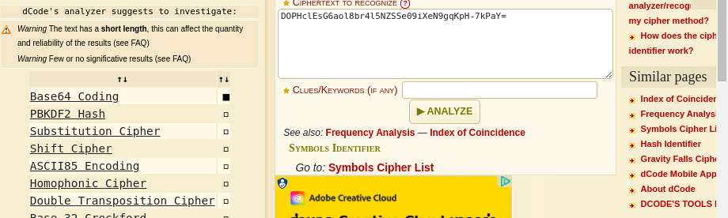

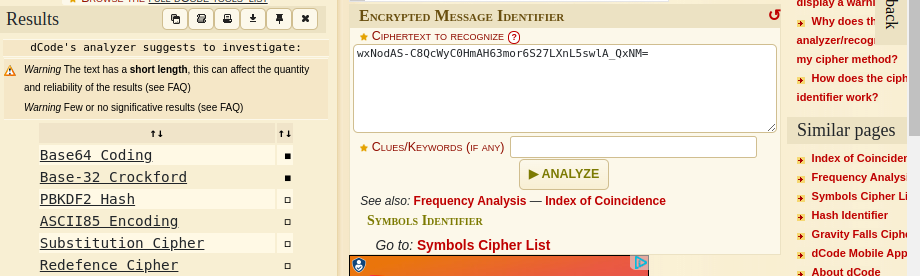

Other cipher testing included:

`https://www.boxentriq.com/code-breaking/cipher-identifier`, which could not identify the type of keys used (Ahlen, 2023)

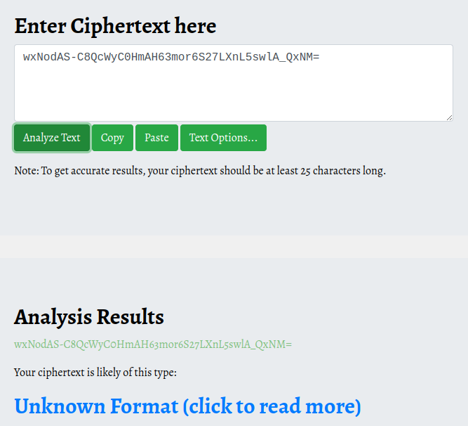

Ciphey CLI tool (PyPi, 2021), which was not able to download:

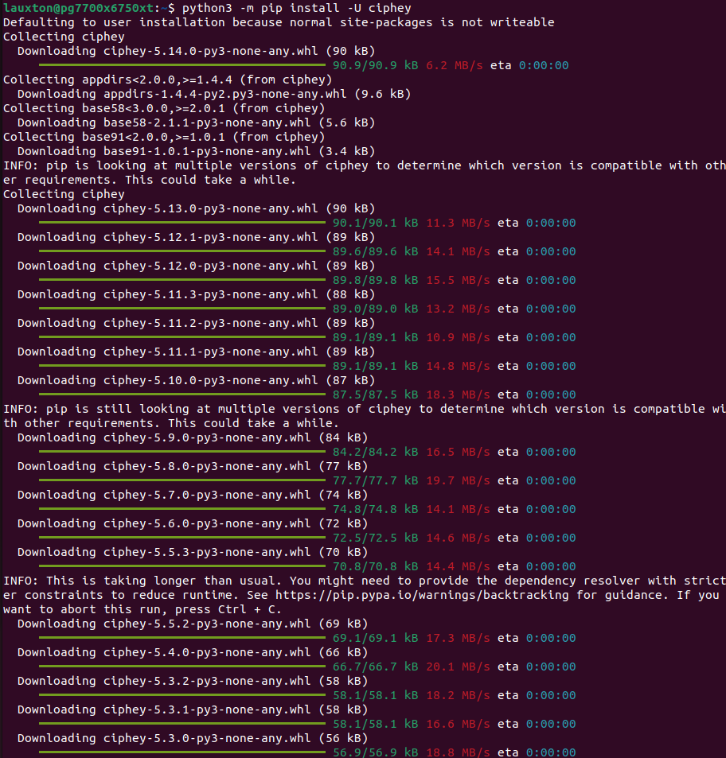
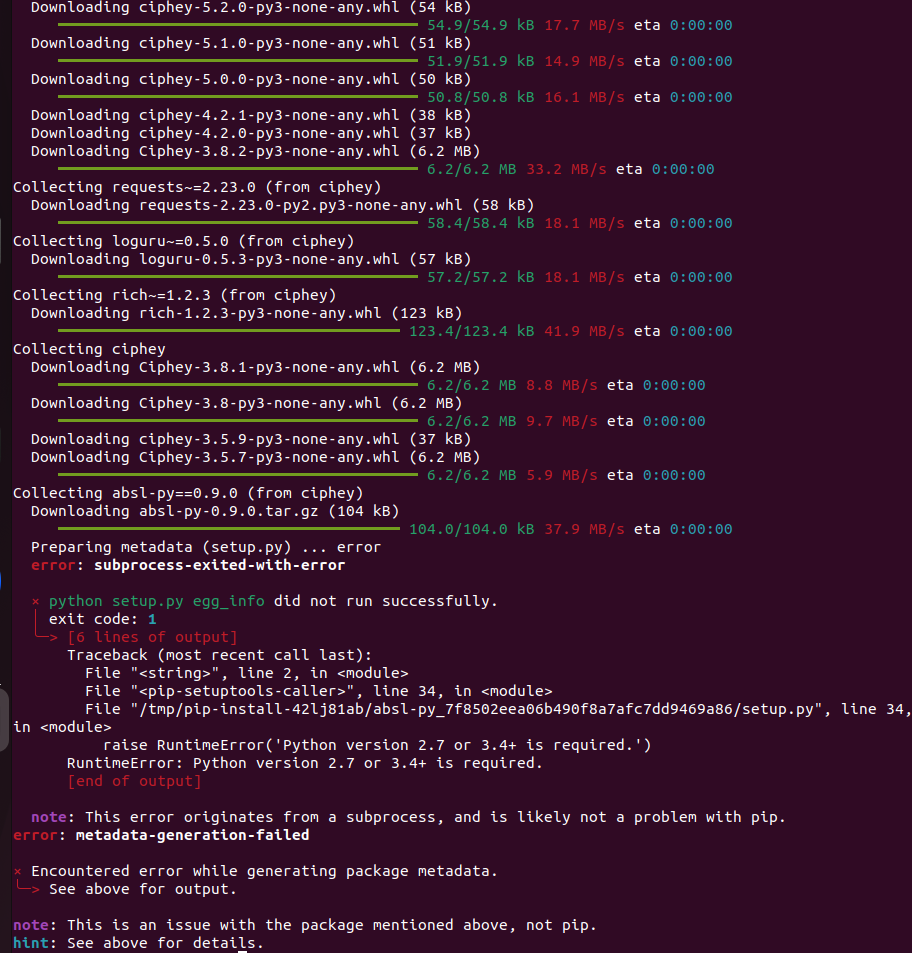

Katana Encryption tool (Foundry, n.d.), which was proprietary and required knowledge of the key encryption algorithm type:

`https://gchq.github.io/CyberChef/` (gchq, 2023), which required knowledge of the key encryption algorithm type. 

Solving for the keys with Katana or CyberChef would be possible, but time and resource intensive as the attacker would have to run the decryption cycle on several algorithm types. With this it can be deduced that basic hacking skills and knowledge do not result in easy idenfication of RSA and Fernet encryption keys. We can thus conclude from this limited test that RSA and Fernet encryption keys are more robust than SHA512 encryption, proving the null hypothesis false.

## References

Ambat, M. K., Bhonge, H. N., & Chandavarkar, B. R. (2020) An Experimental Evaluation of SHA-512 for Different Modes of Operation. In: _11th ICCCNT 2020, 1-3 July 2020, Kharagpur, India._ IEEE: 1 - 6

Avocari (2021) _TryHackMe | Crack the Hash_. Youtube.com. [Available Online] https://www.youtube.com/watch?v=4kJZxMd7NmM

Ahlen, J. (2023) _Cipher Identifier and Analyzer_. Boxentriq. [Available Online] https://www.boxentriq.com/code-breaking/cipher-identifier

gchq (2023) _CyberChef_. gchq.github.io [Available Online] https://gchq.github.io/CyberChef/

Dobraunig, C., Eichlseder, M., & Mendel, F. (2015) Analysis of SHA-512/224 and SHA-512/256. In: _ASIACRYPT 2015_. International Association for Cryptologic Research: 612 - 630

DCode (2023) _Cipher Identifier_ | Cryptography. DCode. [Available Online] https://www.dcode.fr/cipher-identifier

Foundry (n.d.) Katana | Try Katana Today. foundry.com. [Available Online] https://www.foundry.com/products/katana/try-katana

Hamza, A. & Kumar, B. (2020) A Review Paper on DES, AES, RSA Encryption Standards. In: _9th International Conference on System Modelling & Advancement in Research Trends, 4-5 December 2020_. IEEE: 333 - 338

Hashcat (2022) _Hashcat: Advanced Password Recovery_ | Hashcat. hashcat.net. [Available Online] https://hashcat.net/hashcat/
 
Pronika & Tyagi, S. S. (2021) Enhancing Security of Cloud Data through Encryption with AES and Fernet Algorithm through Convolutional-Neural-Networks (CNN). _International Journal of Computer Networks and Applications_, 8(4): 288 - 299

PyPi (2015) _HashID 3.1.4_ | PyPi. pypi.org. [Available Online] https://pypi.org/project/hashID/

PyPi (2022) _Ciphey 5.14.0_ | PyPi. pypi.org. [Available Online] https://pypi.org/project/ciphey/

PyPi (2023) _Pylint 3.0.2_ | PyPi. pypi.org [Available Online] https://pypi.org/project/pylint/#:~:text=Pylint%20is%20a%20static%20code,the%20code%20could%20be%20refactored.
Tang, X. & Zhou, X. (2011) Research and Implementation of RSA Algorithm for Encryption and Decryption. In: _The 6th International Forum on Strategic Technology_. IEEE: 1118 - 1121

Asaad, C., Ismail, E. Naoufal, R. (2020) Fernet Symmetric Encryption Method to Gather MQTT E2E Secure Communications for IoT Devices. 
