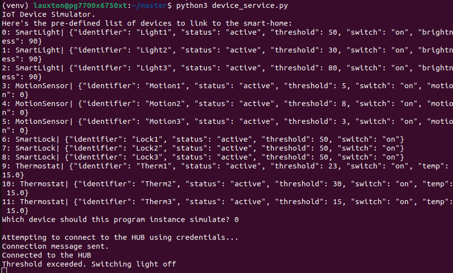

# Smart Home Prototype (SSA 2023)
The following program is a prototype for The Smart Home by The A Team (Group 1) to satify the requirements of Assignment 2 of the Secure System Architecture module. The program comprises an initialiser, server, and client hub, and has been encrypted with RSA and Fernet keys. The focus of the project hypothesis question are the veracity of these keys' security as compared to SHA512.

## Setup
### Prerequisites
* Python ^3.10
* hashid (`sudo apt-get install hashid`)

### Installing
1. Install the required dependencies in `requirements.txt`:
2. 
   ` `pip install -r requirements.txt` (Windows) || `pip3 install -r requirements.txt`
   
3. Run `python initialise.py` (Windows) || `python3 initialise.py` (Linux)

This will initialise the RSA and Ferent keys for encryption.

## Run the Program
On a separate terminal each:
1. Run `python deviceservice.py` || `python3 deviceservice.py`
2. Run `python hub.py` || 'python3 hub.py`

Device simulation is set by running `deviceservice.py`. 

Device settings can be manipulated by interacting with the client interface in `hub.py` 

## Assumptions
1. For the purpose of this proof of concept demo, the devices are assumed to use the same set of public and private encryption keys
   
## Discussion

### Program testing

### Security Testing

Testing the ability of RSA and Fernet encryption to withstand hash identification is at the heart of this project. Our team sought to build a comprehensive clienthub and server that could simulate actual smart device use, and then encrypt that program. Our goal was then to demonstrate that RSA and Ferent encryption hashes were harder to crack than SHA512 hashes. 

RSA was chosen as an encryption key (Hamza & Kumar, 2020) because 
* it is asymmetric and has both public and private keys
* the Diffiee-Hellman algorithm "is a key component of the framework" (Tang & Zhou, 2011: )

Forent was chosen as an encryption key (Pronika & Tyagi, 2021) because 
* it is symmetrical and a "lightweight method based on AES-128-CBC" (Asaad et al., 2022: 1)
* this algorithm is intended for constrained IoT devices not unlike the simulated devices in our code.

These keys were used together in the project, as it is standard practice to have async and sync encryption in IoT (Tang & Zhoi, 2011).

SHA512 was chosen as a control encryption (null hypothesis) key because
* it is standardized by NIST (Dobraunig et al, 2015)
* it is the "most widely used hash function" (Ambat et al, 2020), and is considered more secure than other hash functions

### Hypothesis Testing

Proving the veracity of an encryption algorithm can be difficult outside the realm of mathematics, so our group decided to take a hacker's mindset to testing. We would see how easy each hash was to identify, as once the type of hash encryption is known bruteforcing can be quite simple.

To set a null hypothesis, we took a piece of code from an unused earlier version of our project and implemented SHA512 to encrypt some passwords and ran the program to generate a hash:

We then ran this hash through the popular command line tool _Hashid_ (xxxx, xxxx), which can determine the type of hash presented to be further decrypted by bruteforcing tools like _Hashcat_ (xxxx,). This resulted in a positive hit in the system, correctly determining the hash to be SHA512:

The real-world effort to cracking this hash would be minimal, and those without much hacking skill would be able to figure out how to do so from a hacking tutorial on Youtube (XXXX, XXXX). We thus set this as our H0: all hashes would behave similarly to SHA512.

We then repeated the process for the RSA and Fernet hashes, which were provided during initialisation. Both the RSA hash and Fernet hashes were tested using three hash-line configurations: full, base, and with backticks, and were found to be unknown in the _hashid_ system: 

These results indicate the encryption algorithms are not readily available, as _hashid_ is a well known hacking tool and is quite comprehensive in scope (xxxx, xxxx) and thus take more resources and commitment to crack. 

Even so, we wanted to do an additional test to see if the RSA and Fernet encryption hashes could be broken through an encryption website. RSA and Fernet may not be included in hash-defeat command-line tools, but they may be vulnerable against dedicated cipher-cracking.

We used the website `https://www.dcode.fr/cipher-identifier` to see if the cipher type could be recognised. This website has a comprehensive cipher library, and though it is not a hacking website is easily accessible to hackers looking to verify encryption type.

Results did not result in either RSA or Fernet suggestions:

With this it can be considered that basic hacking skills and knowledge do not result in easy idenfication of RSA and Fernet encryption keys. Though it is true that all encryption can be broken, the resources and commitment required to identify and bruteforce the hashed keys can be great deterrents to cyber attackers. SHA512 was idenfied with little effort or knowledge on behalf of the hacker; RSA and Fernet were not so easy to break. We can thus conclude with this limited test that RSA and Fernet encryption keys are more robust than SHA512 encryption, and so we utilised them in our program accordingly.

## References

Ambat, M. K., Bhonge, H. N., & Chandavarkar, B. R. (2020) An Experimental Evaluation of SHA-512 for Different Modes of Operation. In: _11th ICCCNT 2020, 1-3 July 2020, Kharagpur, India._ IEEE: 1 - 6

Dobraunig, C., Eichlseder, M., & Mendel, F. (2015) Analysis of SHA-512/224 and SHA-512/256. In: _ASIACRYPT 2015_. International Association for Cryptologic Research: 612 - 630

Pronika & Tyagi, S. S. (2021) Enhancing Security of Cloud Data through Encryption with AES and Fernet Algorithm through Convolutional-Neural-Networks (CNN). _International Journal of Computer Networks and Applications_, 8(4): 288 - 299

Hamza, A. & Kumar, B. (2020) A Review Paper on DES, AES, RSA Encryption Standards. In: _9th International Conference on System Modelling & Advancement in Research Trends, 4-5 December 2020_. IEEE: 333 - 338

Tang, X. & Zhou, X. (2011) Research and Implementation of RSA Algorithm for Encryption and Decryption. In: _The 6th International Forum on Strategic Technology_. IEEE: 1118 - 1121

Asaad, C., Ismail, E. Naoufal, R. (2020) Fernet Symmetric Encryption Method to Gather MQTT E2E Secure Communications for IoT Devices. 
